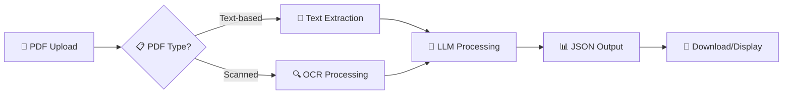

# 🚀 Resume Extractor


**Transform PDF resumes into structured JSON data with AI-powered extraction** ✨

[Features](#-features) • [Demo](#-demo) • [Installation](#-installation) • [Usage](#-usage) • [API](#-api-documentation) • [Contributing](#-contributing)

---

## 🎯 Overview

Resume Extractor is an intelligent document processing system that converts PDF resumes (both text-based and scanned) into structured JSON format. Built with modern web technologies and powered by local LLM models via Ollama, it provides accurate data extraction with complete privacy.

### 🌟 Key Highlights

- 📄 **Dual PDF Support**: Handles both text-based and scanned/image-based resumes
- 🤖 **AI-Powered**: Uses fine-tuned LLM models for intelligent data extraction
- 🔒 **Privacy-First**: All processing happens locally - no data leaves your machine
- 📊 **Benchmarked**: Evaluated multiple models (Llama3, Mistral, Qwen) using precision, recall, and F1-score
- 🎨 **Modern UI**: Beautiful, responsive React frontend with drag-and-drop functionality
- ⚡ **Fast API**: High-performance FastAPI backend with async processing

---

## ✨ Features

### 🔍 **Smart Extraction**
- **Personal Information**: Name, phone, email, location, LinkedIn
- **Education**: Degrees, universities, locations, durations
- **Experience**: Job titles, companies, durations, locations, detailed descriptions
- **Skills**: Individual skill extraction and categorization

### 📋 **Document Processing**
- **OCR Support**: Advanced text extraction from scanned PDFs using PyMuPDF
- **Text Parsing**: Direct text extraction from native PDF documents
- **Auto-Detection**: Automatically determines PDF type and applies appropriate processing
---

## 🎬 Demo

### 📱 **Web Interface**
- Drag & drop PDF upload
- Real-time PDF preview
- Instant JSON output
- Download extracted data
- Beautiful gradient UI with smooth animations

### 🔄 **Processing Flow**


---

## 🛠 Installation

### Prerequisites
```bash
# Install Ollama
curl -fsSL https://ollama.ai/install.sh | sh

# Pull required model
ollama pull llama3:instruct
```

### 1️⃣ Clone Repository
```bash
git clone https://github.com/abirm74/CV-Extractor-with-Open-Source-LLMs-using-Ollama.git
cd resume-extractor
```

### 2️⃣ Quick Setup (Recommended)
```bash
# Install all dependencies at once
npm run setup
```

### 3️⃣ Manual Setup (Alternative)
```bash
# Backend dependencies
python -m venv venv
source venv/bin/activate  # On Windows: venv\Scripts\activate
pip install -r requirements.txt

# Frontend dependencies
cd frontend && npm install
```

---

## 🚀 Usage

### 🎯 **One-Command Start (Recommended)**
```bash
# Start both backend and frontend simultaneously
npm run dev
```
🌐 API: `http://localhost:8000` | 🎨 Web App: `http://localhost:3001`

### 🔧 **Individual Commands**
```bash
# Backend only
npm run start-backend

# Frontend only  
npm run start-frontend

# Build frontend for production
npm run build
```

### 📱 Using the Web Interface

1. **Upload**: Drag & drop or click to select PDF resume
2. **Preview**: View your PDF in the left panel
3. **Extract**: Click "Extract Resume Data" button
4. **Download**: Get structured JSON output

---

## 📚 API Documentation

### 🔌 Endpoints

#### `POST /api/v1/upload`
Extract structured data from resume PDF

**Request:**
```bash
curl -X POST "http://localhost:8000/api/v1/upload" \
  -H "Content-Type: multipart/form-data" \
  -F "file=@resume.pdf"
```

**Response:**
```json
{
  "resume_data": {
    "name": "John Doe",
    "phone": "+1-234-567-8900",
    "mail": "john.doe@email.com",
    "location": "New York, NY",
    "linkedin": "linkedin.com/in/johndoe",
    "education": [...],
    "experience": [...],
    "skills": [...]
  },
  "extracted_text": "Raw extracted text..."
}
```

#### `GET /health`
API health check

#### `GET /docs`
Interactive API documentation (Swagger UI)

---

## 🏗 Project Architecture

```
/project_root
│
├── package.json               # 🚀 Root scripts for easy development
├── requirements.txt           # Python dependencies
├── .env                      # Environment variables
│
├── 📁 backend/               # FastAPI application
│   ├── main.py              # Main FastAPI entry point
│   ├── 📁 api/              # API route handlers
│   │   └── routes.py        # Upload & processing endpoints
│   └── 📁 core/             # Core business logic
│       ├── file_processor.py # OCR & text extraction
│       ├── llm_processor.py  # LLM integration
│       └── resume_schema.py  # Pydantic models
│
├── 📁 frontend/             # React application
│   ├── package.json
│   ├── 📁 public/
│   └── 📁 src/
│       ├── App.js           # Main React component
│       ├── index.js
│       └── index.css
│
├── 📁 data/                 # Sample data
│   ├── scanned_cvs/
│   └── text_cvs/
│
├── 📁 evaluation/           # Model evaluation
│   ├── ground_truth.json
│   └── evaluate.py
│
└── 📁 outputs/             # Generated outputs
    ├── json_llama3_instruct/
    ├── json_mistral/
    └── json_qwen_7b/
```

---

## 🔮 Upcoming Features

### 🎯 **Job Matching Analysis**
- Compare resumes against job postings
- Calculate compatibility scores
- Provide improvement suggestions
- Highlight missing skills

### ⚡ **Performance Enhancements**
- Model quantization for faster inference
- Batch processing capabilities
- Caching mechanisms
- Async processing queues

### 🎨 **UI/UX Improvements**
- Dark/light theme toggle
- Advanced filtering options
- Bulk processing interface
- Real-time processing status

---

## 🔧 Technology Stack

### Backend
- **FastAPI**: Modern, fast web framework
- **PyMuPDF**: PDF processing and OCR
- **Ollama**: Local LLM inference
- **Pydantic**: Data validation and serialization

### Frontend
- **React 18**: Modern React with hooks
- **Lucide React**: Beautiful icons
- **React Dropzone**: File upload functionality
- **Axios**: HTTP client

### AI/ML
- **Llama3 Instruct**: Primary extraction model
- **Mistral & Qwen**: Alternative models for comparison
- **Custom Evaluation Pipeline**: Precision, recall, F1-score metrics

---

## 📊 Evaluation Metrics

Our evaluation pipeline tests extraction accuracy across multiple dimensions:

- **🎯 Precision**: Accuracy of extracted information
- **📈 Recall**: Completeness of information extraction  
- **⚖️ F1-Score**: Harmonic mean of precision and recall
- **🔍 Field-Level Analysis**: Individual field performance tracking

### 📋 Test Dataset
- 100+ diverse resume samples
- Multiple formats and layouts
- Both text-based and scanned documents
- Ground truth annotations for validation

---

## 🤝 Contributing

We welcome contributions! Here's how you can help:

### 🐛 **Bug Reports**
Found a bug? Please open an issue with:
- Detailed description
- Steps to reproduce
- Expected vs actual behavior
- Sample files (if applicable)

### ✨ **Feature Requests**
Have an idea? We'd love to hear it! Open an issue with:
- Feature description
- Use case scenarios
- Potential implementation approach

### ⚡ **Available Scripts**

| Command | Description |
|---------|-------------|
| `npm run dev` | 🚀 Start both backend and frontend simultaneously |
| `npm run setup` | 📦 Install all dependencies (backend + frontend) |
| `npm run start-backend` | 🔧 Start only the FastAPI backend |
| `npm run start-frontend` | 🎨 Start only the React frontend |
| `npm run build` | 📦 Build frontend for production |
1. Fork the repository
2. Create a feature branch (`git checkout -b feature/amazing-feature`)
3. Commit changes (`git commit -m 'Add amazing feature'`)
4. Push to branch (`git push origin feature/amazing-feature`)
5. Open a Pull Request

---

## 📄 License

This project is licensed under the MIT License - see the [LICENSE](LICENSE) file for details.

---

## 🙏 Acknowledgments

- **Ollama Team** for the fantastic local LLM infrastructure
- **FastAPI** for the excellent web framework
- **React Community** for the amazing frontend ecosystem
- **PyMuPDF** for robust PDF processing capabilities

---

## 📞 Support

- 📧 **Email**: moulaabir.am@gmail.com
- 💬 **Issues**: [GitHub Issues](https://github.com/abirm74/CV-Extractor-with-Open-Source-LLMs-using-Ollama/issues)


---

### 🌟 If this project helped you, please give it a star! 🌟

**Made with ❤️ and lots of ☕**

⭐ [Star this repo](https://github.com/abirm74/CV-Extractor-with-Open-Source-LLMs-using-Ollama) • 🍴 [Fork it](https://github.com/abirm74/CV-Extractor-with-Open-Source-LLMs-using-Ollama/fork) • 🐛 [Report issues](https://github.com/abirm74/CV-Extractor-with-Open-Source-LLMs-using-Ollama/issues)